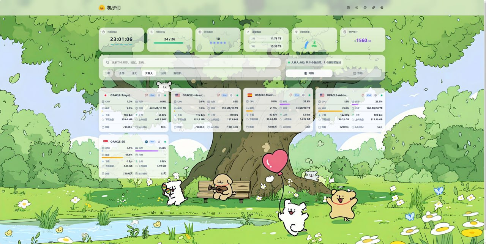
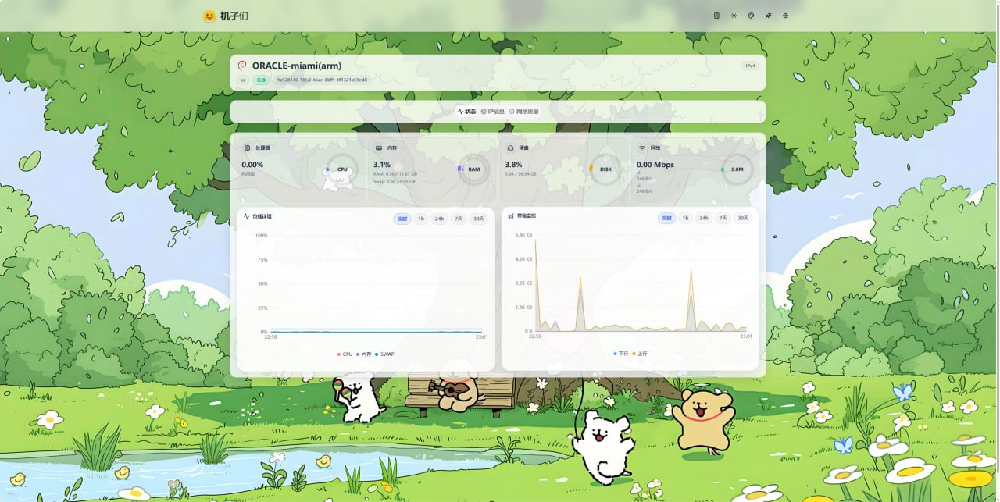
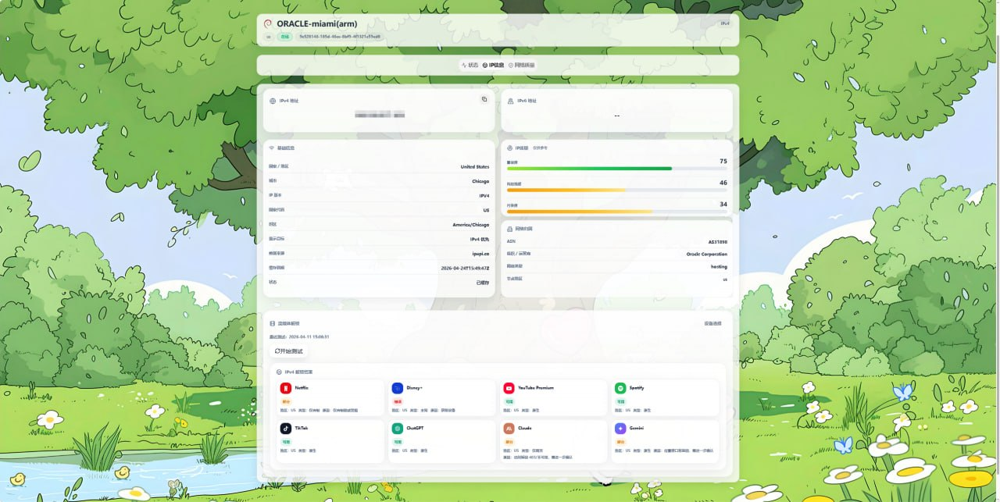
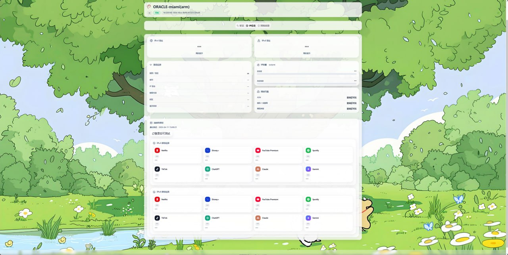
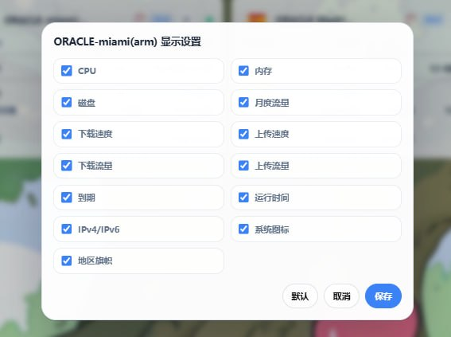

# Komari Next Pro

Komari Next Pro 是一个 Komari 自定义主题，在 `komari-next` 的基础上深度重构，并附带一个可选的 `unlock-probe` 后端，用于流媒体解锁展示和节点卡片高级配置。

## 项目简介

本仓库分为两个模块：

- `theme/` —— Komari 前端主题（含源码与编译产物）
- `unlock-probe/` —— 可选后端，用于流媒体解锁探测与节点卡片字段配置

你可以只使用主题，也可以把主题和后端一起部署，获得完整体验。

## 功能特性

### 主题部分
- 现代化主页与 dashboard 布局
- 重做的节点卡片与详情页
- 更丰富的 IP 信息与网络质量展示
- 资产统计与更强的视觉表现
- 可接入 Komari admin 的主题配置支持
- 更好的公开展示隐私管理
- 多语言 UI 基础

### 2.0 新增功能

#### 🎭 心情与养成系统

为每台服务器赋予"生命感"。系统根据实时负载自动显示心情表情，根据累计运行时间赋予成长等级。

**心情表情（基于 1 小时平均 CPU / 内存负载）：**

| 条件 | 表情 | 状态 |
|------|------|------|
| CPU > 90% 或 Mem > 95% | 😰 | 危险 |
| CPU > 80% 或 Mem > 85% | 😰 | 紧张 |
| CPU > 50% 或 Mem > 70% | 😤 | 忙碌 |
| CPU > 15% 或 Mem > 40% | 😊 | 正常 |
| CPU > 3% 或 Mem > 20% | 😌 | 悠闲 |
| CPU ≤ 3% 且 Mem ≤ 20% | 😴 | 睡觉 |
| 离线 | 💀 | 离线 |

**等级徽章（基于累计运行天数）：**

| 等级 | 名称 | 所需天数 | 徽章样式 |
|------|------|----------|----------|
| Lv1 | 新生 | 0 天 | 灰色 |
| Lv2 | 幼苗 | 7 天 | 绿色渐变 |
| Lv3 | 成长 | 30 天 | 蓝色渐变 |
| Lv4 | 茁壮 | 90 天 | 靛蓝渐变 |
| Lv5 | 老将 | 180 天 | 紫色渐变 |
| Lv6 | 传说 | 365 天 | 金色渐变 |

每个等级徽章附带经验进度条，直观展示距离下一等级的进度。鼠标悬停可查看详细信息（当前等级、运行天数、下一级所需天数）。

#### 💰 资产计算器增强

- 多币种实时汇率转换（CNY / USD / EUR / GBP）
- 弹窗自适应高度，节点列表自动填满可用空间
- 按剩余价值排序，快速定位高价值资产

#### 📊 主界面状态栏优化

重新设计的顶部状态栏，支持展开查看详细信息：
- 当前时间与在线统计
- 地区分布概览（点亮地区数）
- 流量使用总览（总上传/下载）
- 实时网络速率
- 资产估值概览

#### 📈 月度流量精度优化

节点卡片的月度流量显示从整数升级为一位小数精度（如 28.3 GB / 10.0 TB），更准确反映实际用量。

#### 🖥️ 服务器子页 — 本地服务快照

在服务器详情页新增本地服务监控面板：
- 实时展示节点上运行的服务状态（运行中 / 已停止 / 异常）
- 一键查看服务日志输出
- 支持自定义监控的服务列表
- 异常服务高亮提醒

#### 📱 移动端适配

- 卡片布局自动适配手机屏幕
- 触摸友好的交互设计
- 状态栏折叠为紧凑模式
- 弹窗与面板全屏展示优化

### 可选 unlock-probe 后端
- 支持手动触发流媒体解锁检测
- 展示最近一次缓存结果
- IPv4 / IPv6 分离显示
- 支持每节点卡片字段显隐配置
- 支持定时批量检测
- 写操作需登录，公开结果可脱敏输出
- 对敏感解锁详情提供更适合公开访问的隐私保护展示

## 仓库结构

```text
.
├── theme/
│   ├── src/              # 主题源码
│   ├── dist/             # 编译产物（可直接部署）
│   ├── komari-theme.json # 主题配置文件
│   └── preview.png       # 预览图
├── unlock-probe/
├── docs/
├── scripts/
├── README.md
├── README-CN.md
├── SECURITY.md
├── .env.example
└── docker-compose.yml
```

## 快速开始

### 方案 A：直接使用编译产物（推荐）

下载 [最新 Release](https://github.com/fanchengliu/komari-next-pro/releases) 中的 `komari-next-pro-v2.0.0.tar.gz`，解压到 Komari 主题目录即可：

```bash
tar xzf komari-next-pro-v2.0.0.tar.gz -C /path/to/komari/data/theme/
```

或者直接使用仓库中的 `theme/dist/` 目录：

```bash
cp -r theme/dist /path/to/komari/data/theme/komari-next-pro/dist
cp theme/komari-theme.json /path/to/komari/data/theme/komari-next-pro/
cp theme/preview.png /path/to/komari/data/theme/komari-next-pro/
```

### 方案 B：从源码构建

```bash
cd theme
npm install
npm run build
```

构建完成后，将产物与 `theme/komari-theme.json` 一起上传到 Komari 的主题目录。

### 方案 C：主题 + unlock-probe 一起部署

如果你需要流媒体解锁展示、缓存结果和节点卡片字段控制：

1. 构建并部署 `theme/`
2. 部署 `unlock-probe/`
3. 使用反向代理把 `/unlock-probe/` 转发到后端
4. 配置环境变量，例如：
   - `KOMARI_BASE`
   - `KOMARI_USER`
   - `KOMARI_PASS`
   - `UNLOCK_PROBE_PORT`

你也可以直接使用仓库中的 `docker-compose.yml` 启动后端。

## Theme 模块

`theme/` 目录是 Komari 主题本体。

主要目标：
- 优化首页展示
- 重做节点卡片与详情页 UI
- 提供更丰富的 IP / 网络质量信息
- 支持与 companion probe 后端联动

构建方式：

```bash
cd theme
npm install
npm run build
```

## Unlock Probe 模块

`unlock-probe/` 目录是可选后端服务。

主要职责：
- 执行探测流程
- 提供最近一次缓存解锁结果
- 管理卡片字段显隐配置
- 支持定时批量执行

示例启动方式：

```bash
cd unlock-probe
PORT=19116 \
KOMARI_BASE=http://127.0.0.1:25774 \
KOMARI_USER=admin \
KOMARI_PASS=change-me \
node server.mjs
```

## 一键安装 unlock-probe

你可以直接通过 Release 附件安装可选的 unlock-probe 后端：

```bash
curl -fsSL -o install-unlock-probe.sh https://raw.githubusercontent.com/fanchengliu/komari-next-pro/main/scripts/install-unlock-probe.sh
bash install-unlock-probe.sh
```

也支持通过环境变量覆盖参数，例如：

```bash
INSTALL_DIR=/opt/komari-next-pro-unlock-probe \
KOMARI_BASE=http://127.0.0.1:25774 \
KOMARI_USER=admin \
KOMARI_PASS='你的密码' \
UNLOCK_PROBE_PORT=19116 \
bash install-unlock-probe.sh
```

## 部署说明

### 反向代理

仓库中提供了一个最小 Nginx 示例：

```text
docs/nginx-example.conf
```

### 定时任务

systemd timer 参考说明位于：

```text
docs/systemd-timers.md
```

## 部分截图展示

### 首页 dashboard



### 实例状态页



### IP 信息与流媒体解锁



### IPv4 / IPv6 解锁结果展示



### 卡片隐私与显示设置



## 当前状态

仓库完整开源。  
不断优化改进。

## 贡献者

- OpenClaw
- Claude
- Codex

## License

见 [LICENSE](./LICENSE)。
