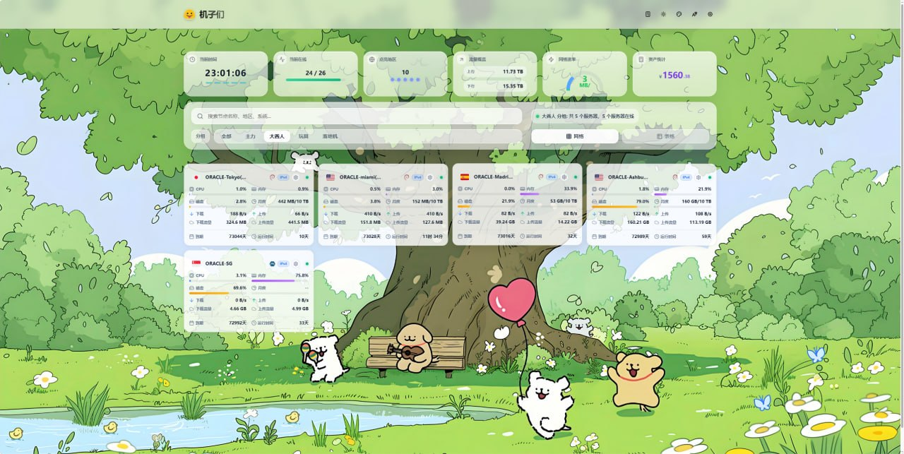
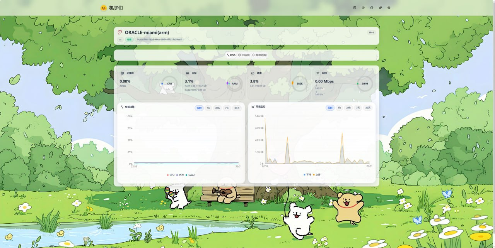
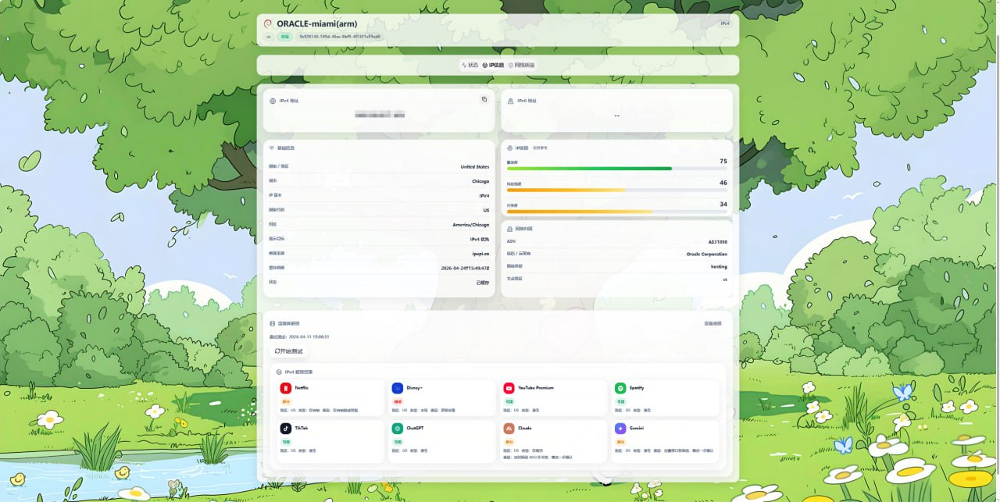
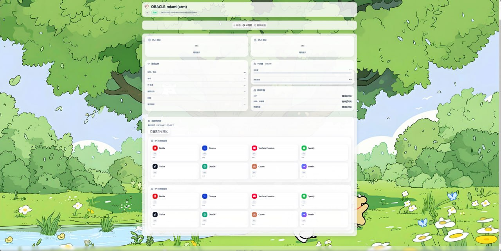
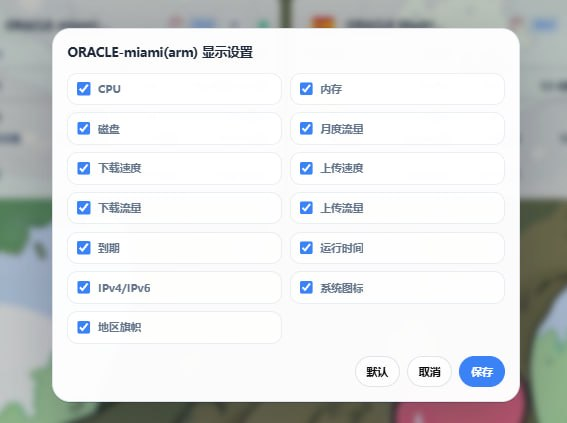

# Komari Next Pro

Komari Next Pro is a custom theme for Komari, bundled with an optional `unlock-probe` backend for stream unlock display and advanced card configuration.

## Overview

This repository is split into two modules:

- `theme/` — the frontend theme for Komari
- `unlock-probe/` — an optional backend service used for stream unlock probing and node card field configuration

You can use the theme alone, or deploy both modules together for the full experience.

## Features

### Theme
- Modern homepage and dashboard layout
- redesigned node cards and instance detail pages
- richer IP information and network quality display
- asset overview and more expressive visual presentation
- Komari admin theme-managed configuration support
- improved privacy controls for public display
- multilingual UI base

### Optional unlock-probe backend
- manual stream unlock trigger
- cached latest result display
- IPv4 / IPv6 result separation
- per-node card field visibility configuration
- scheduled batch probing support
- login-protected write actions with masked public output
- privacy-aware public result display for sensitive unlock details

## Repository Structure

```text
.
├── theme/
├── unlock-probe/
├── docs/
├── scripts/
├── README.md
├── README-CN.md
├── SECURITY.md
├── .env.example
└── docker-compose.yml
```

## Quick Start

### Option A: Theme only

Use this if you only want the custom Komari UI.

```bash
cd theme
npm install
npm run build
```

Then upload the built theme assets together with `theme/komari-theme.json` into your Komari theme directory.

### Option B: Theme + unlock-probe

Use this if you want stream unlock display, cached unlock results, and node card field controls.

1. Build and deploy the theme from `theme/`
2. Deploy `unlock-probe/`
3. Reverse proxy `/unlock-probe/` to the backend service
4. Configure environment variables such as:
   - `KOMARI_BASE`
   - `KOMARI_USER`
   - `KOMARI_PASS`
   - `UNLOCK_PROBE_PORT`

You can also start the backend with the provided `docker-compose.yml`.

## Theme Module

The `theme/` directory contains the Komari theme itself.

Main goals:
- improve homepage presentation
- redesign node and detail page UI
- expose richer IP / network quality views
- support integration with a companion probing backend

Build:

```bash
cd theme
npm install
npm run build
```

## Unlock Probe Module

The `unlock-probe/` directory contains the optional backend service.

Main responsibilities:
- execute probing workflows
- expose latest cached unlock results
- manage card field visibility settings
- support scheduled batch execution

Example start:

```bash
cd unlock-probe
PORT=19116 \
KOMARI_BASE=http://127.0.0.1:25774 \
KOMARI_USER=admin \
KOMARI_PASS=change-me \
node server.mjs
```

## Deployment Notes

### Reverse proxy

A minimal Nginx example is included in:

```text
docs/nginx-example.conf
```

### Timers / scheduling

A systemd timer note is included in:

```text
docs/systemd-timers.md
```

## Security Notes

Before making your own fork public:

- remove real credentials
- remove real production IPs and private domains
- remove private deployment workflows
- review public endpoints carefully
- avoid exposing privileged write actions without authentication

See [SECURITY.md](./SECURITY.md) for more details.

## Screenshots

### Homepage dashboard



### Instance status



### IP information and stream unlock panel



### IPv4 / IPv6 unlock result display



### Card privacy and display settings



## Status

This repository is being cleaned up for open-source release.  
The current structure is already split into theme and backend modules, and the documentation is being refined for public deployment.

## Contributors

- OpenClaw
- Claude
- Codex

## License

See [LICENSE](./LICENSE).
