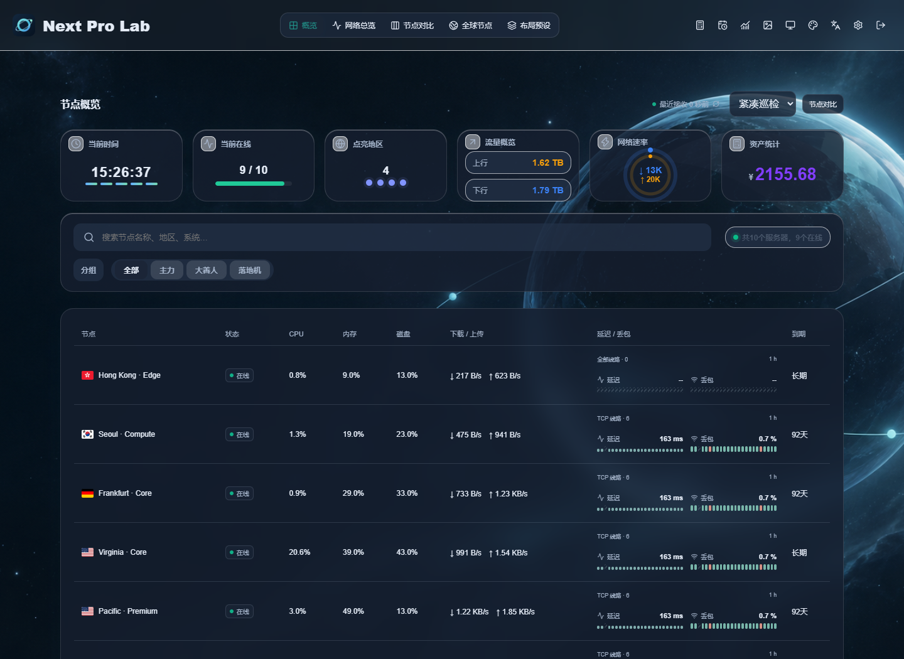
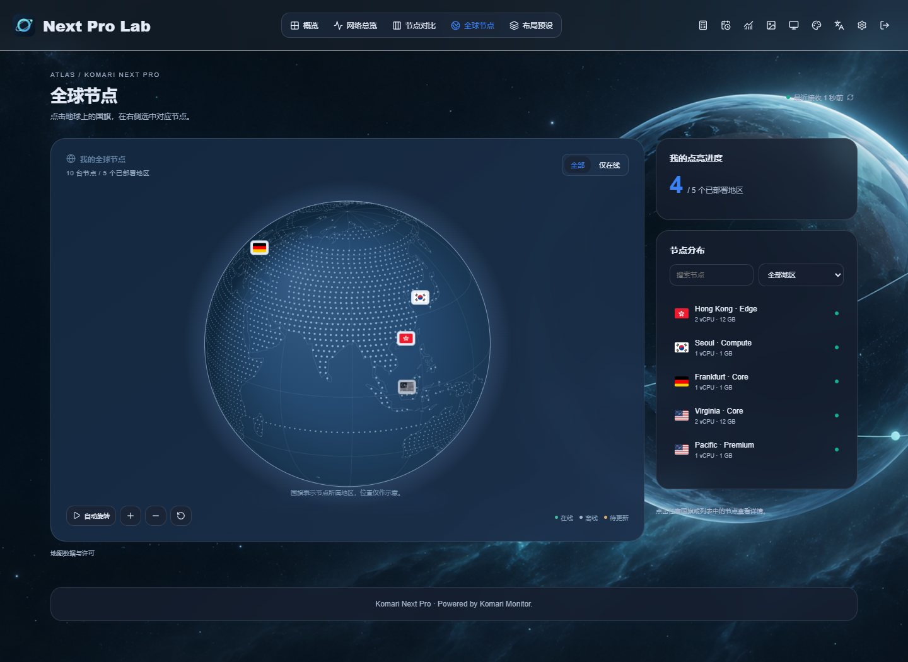
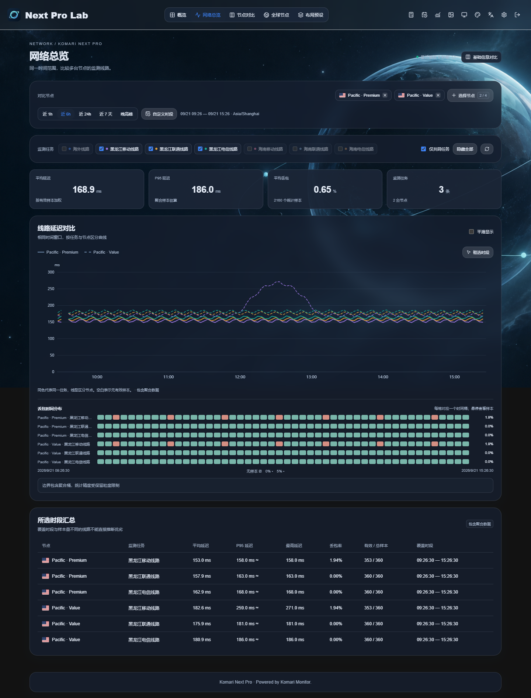

<p align="center"></p>

<p align="center"><b>你的节点，你的网络，一眼看清。</b><br>玻璃卡片 · 全球节点 · 网络对比 · 个性化外观</p>
<p align="center"><a href="README.en.md">English</a> · <a href="https://komari-next-pro.vercel.app/">文档站</a> · <a href="https://github.com/fanchengliu/komari-next-pro/releases">下载</a> · <a href="docs/INSTALL.md">安装</a> · <a href="docs/EXTENSION.md">配套扩展</a> · <a href="docs/MIGRATION.md">升级与回退</a></p>

# Komari Next Pro 

Komari Next Pro 3.0 是本仓库的全新独立重写版本。当前前端、数据适配和配套服务采用独立的 React + TypeScript 实现；旧版代码和发布记录保留在 Git 历史中。

一个主题，从日常展示到节点巡检：看运行状态、比较线路、回看网络历史，再把整个界面调成自己的样子。



## 有什么

| 功能 | 你可以做的事 |
| --- | --- |
| 日常与紧凑布局 | 卡片展示、表格巡检、手机布局，按节点名称和分组筛选 |
| 网络历史 | 查看延迟/丢包时间格，悬停、选择时段、展开完整曲线 |
| 节点对比 | 最多四台节点的基础信息与同时间窗口网络对比 |
| 全球节点 | 可旋转地球、逐节点国旗、节点列表联动；地理位置为地区示意 |
| 资产与到期 | 免费/付费筛选、长期节点、到期时间线、自动参考汇率 |
| 个性化 | 卡片透明度、配色、图片/视频背景、首次配置向导 |
| 概览弹窗 | 世界时钟、在线节点、流量、速率、资产和首页地球 |
| 五种语言 | 简体中文、繁體中文、English、日本語、한국어 |

<table><tr><td></td><td></td></tr><tr><td>点亮你的节点地图</td><td>在同一时间窗口比较线路</td></tr></table>

## 安装

1. 在 [Releases](https://github.com/fanchengliu/komari-next-pro/releases) 下载 `komari-next-pro-3.0.1-theme.zip`。
2. 到 Komari 管理后台上传主题 ZIP，选择 **Komari Next Pro**。
3. 返回首页，通过首次配置向导选择布局与背景。

下载自动生成的 GitHub “Source code” ZIP 不能代替可安装主题包。已有 komari-ds 用户的安装标识仍为 `komari-ds`，配置与扩展路径保持兼容；Next Pro 用户请先阅读 [迁移说明](docs/MIGRATION.md)。

**只装主题就能使用核心监控、图表、对比与地球。** 服务端媒体库、远程媒体下载和手动节点检测使用可选配套扩展，见 [扩展部署](docs/EXTENSION.md)。

## 数据说明

- 界面展示来自 Komari 的实际数据；README 截图使用明确的合成演示数据。
- IP 参考分是可查看依据的规则估算，没有随机扰动，**不是实际信誉检测或风险概率**。真实质量源指标另行展示，需要相应服务端配置。
- 流媒体面板展示 HTTP 探测证据，可访问不等于账号或地区完全解锁。
- 自动汇率是最新公布的参考值，带日期与缓存状态，不是秒级交易报价。
- 历史流量受后端保留范围与采样精度约束，未知不填零。详见 [数据口径](docs/DATA.md)。

## 本地开发

需要 Node.js **24.15+（24 或 26）**。Windows PowerShell 如拦截 npm.ps1，请使用 `npm.cmd`。

```sh
npm ci --ignore-scripts
npm run demo
# 另开终端
npm run dev
```

打开 `http://127.0.0.1:5173`，演示登录 `demo / demo`。演示服务仅监听本机，合成 IP 使用文档示例网段。

```sh
npm test
npm run build
npx playwright install chromium
npm run test:e2e
npm run package
```

Windows 默认使用 Edge；可通过 `DS_BROWSER` 指定 Chromium 路径。Linux/macOS 使用 Playwright 安装的 Chromium。产物位于 `releases/`，含主题、源码、扩展与 SHA-256 清单。

## 项目结构

```text
apps/theme/       React 主题、RPC 客户端与界面
apps/extension/   独立媒体库、汇率缓存与手动检测
packages/         共享配置与数据规则
tests/            数据、服务和浏览器场景
deploy/           systemd、Nginx 与 Docker 示例
docs/             安装、迁移、数据与素材来源
```

兼容验证基线：Komari **1.5.0**。没有直接查询 Komari 内部 SQL 表。配套服务写操作验证登录身份、Origin 与 CSRF，检测不自动运行。

## 贡献与许可

欢迎提交问题与 PR，见 [贡献指南](CONTRIBUTING.md) 和 [安全反馈](SECURITY.md)。

代码采用 [MIT License](LICENSE)。原项目版权声明保留；地图数据库、图标及依赖遵循各自许可，详见 [来源说明](docs/PROVENANCE.md)、[地图许可](docs/GEODATA.md) 和 [第三方许可](docs/THIRD_PARTY_NOTICES.md)。默认背景与品牌素材为本项目新制作，不包含个人站点的动漫媒体或私人部署资料。

## 致谢

感谢 [Komari](https://github.com/komari-monitor/komari)、[Komari-next](https://github.com/tonyliuzj/komari-next)，以及所有反馈 Issue、提交 PR 和分享建议的朋友。
